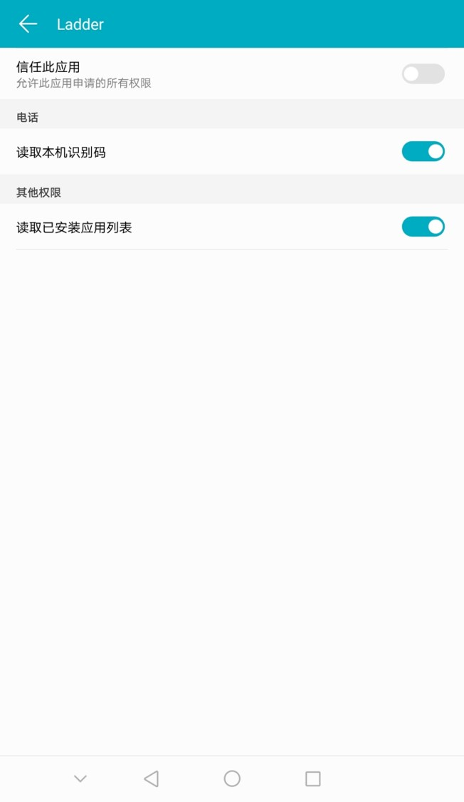
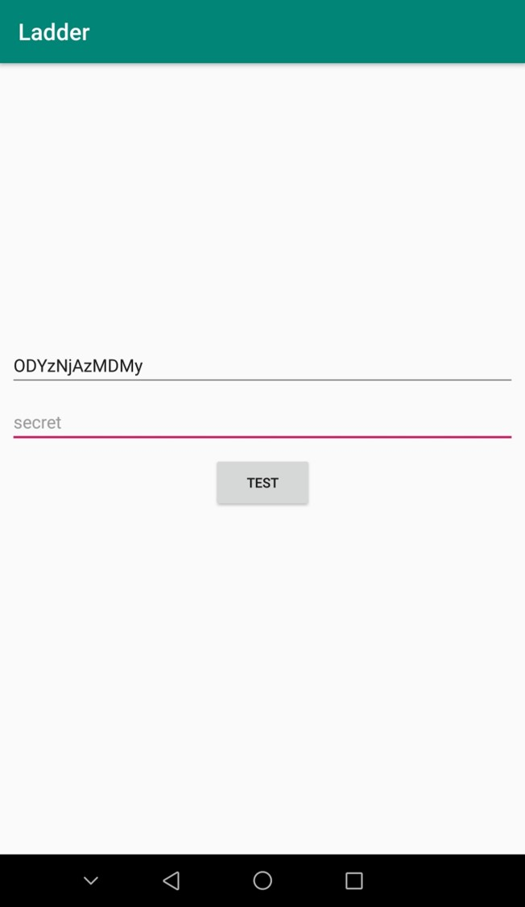

# ladder

##### what is `n`  
node

##### what is `m`  
mode

##### what is 部分  
not all

##### how to get `secret`  
have an issue?

##### free?  
maybe always, at least today

##### why 识别码
used by secret

##### why 应用列表
used by “部分”

  
  
  

  
  
  

